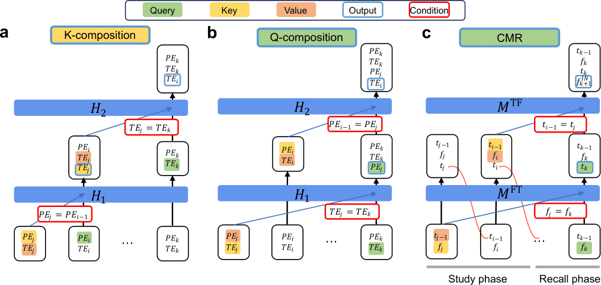

# Linking In-context Learning in Transformers to Human Episodic Memory

This repository is the official implementation of [Linking In-context Learning in Transformers to Human Episodic Memory](https://arxiv.org/abs/2405.14992). 



## Abstract

Understanding connections between artificial and biological intelligent systems can reveal fundamental principles of general intelligence. While many artificial intelligence (AI) models have a neuroscience counterpart, such connections are largely missing in Transformer models and the self-attention mechanism. We examine the relationship between attention heads and human episodic memory. We focus on induction heads, which contribute to in-context learning in Transformer-based large language models (LLMs). We demonstrate that induction heads are behaviorally, functionally, and mechanistically similar to the contextual maintenance and retrieval (CMR) model of human episodic memory. Our analyses of LLMs pre-trained on extensive text data show that CMR-like heads often emerge in the intermediate-to-late model layers, qualitatively mirroring human memory biases. The ablation of CMR-like heads suggests their causal role in in-context learning. Our findings uncover a parallel between the computational mechanisms of LLMs and human memory, offering valuable insights into both research fields.

## Requirements

To install requirements:

```setup
pip install -r requirements.txt
```

## Quick Start

For a quick demonstration of how attention heads in Transformer models share key features with human episodic memory, start from our Google Colab [Demo Notebook](demo.ipynb). We used the GPT2-small model from [TransformerLens](https://github.com/TransformerLensOrg/TransformerLens) to show

- CRP (Conditional Response Probability) analysis of attention heads
- Computing metrics for induction heads (induction-head matching score, copying score)
- Comparing induction heads to episodic retrieval mediated by a temporal context

## Experiments

To replicate the experiments, first obtain (1) the attention & head scores of pre-trained LLMs by running the [Demo Notebook](demo.ipynb) (some of them may take a couple of hours - check the paper appendix for details) and save them under ```saved_scores/<model_name>/``` (e.g., ```saved_scores/gpt2-small/```), as well as (2) the CRPs produced by CMR by running

```
python src/est_cmr_crp.py
```

The command above may take a few days to complete; we have provided the results under ```saved_crps/```.

#### 1. Probing Individual Attention Heads

To visually examine individual attention heads in a model (e.g., Figure 5 and 6a in the paper), run

```
python src/fit_attn_score.py --save_dir <path_to_save_results> --all_head_scores <path_to_saved_scores>
```

The results (pdf) are assumed to be saved under `/fig`, and the pre-computed head scores are assumed to be placed in `/saved_scores`, so please only include the path relative to the respective folders.

For example, to fit and visualize all attention heads of the pre-trained GPT2-small model from [TransformerLens](https://github.com/TransformerLensOrg/TransformerLens) library, make sure there is a directory called `gpt2-small` under `/figs` and run

```
python src/fit_attn_score.py --save_dir gpt2-small --all_head_scores gpt2-small/all_scores_gpt2_small.pkl
```

The file containing all GPT2-small head scores is `/saved_scores/gpt2-small/all_scores_gpt2_small.pkl` and the results will be saved under `/figs/gpt2-small/`.

This analysis provides the head-level fitting result on a specific model, which is most useful if you'd like to visually compare head scores and the fitted CRPs. It also visualizes the fitting outcome as a function of the relative layer position (e.g., Figure 6a) and induction head matching scores (e.g., Figure 5e). The next 3 sections introduces macro- and model-level analyses of attention heads.

#### 2. Comparing models of different sizes

To compare where in a model attention heads most likely exhibit a human-like asymmetric contiguity bias across multiple models (e.g., Figure 6b, c), run

```
python src/attn_over_size.py --model_size <model_size_1> <model_size_2> ...
```

if you are interested in the Pythia models.  For example, ```python src/attn_over_size.py --model_size 70m 160m 410m 1b``` compares the smaller Pythia models (Pythia-70m-deduped-v0, Pythia-160m-deduped-v0, Pythia-410m-deduped-v0, Pythia-1b-deduped-v0; left panel of Figure 6b).

For all other models (i.e., Qwen-7B, Mistral-7B, Llama3-8B), run

```
python src/attn_over_size_xtra.py --models <model_name_1> <model_name_2> ...
```

#### 3. Comparing the same model across different training steps

To examine how the same model evolves over the course of training in terms of memory-related features (e.g., Figure 7b, Supplementary Figure S4), run

```
python src/attn_over_time.py --model_name <model_name>
```

For example, ```python src/attn_over_time.py --model_name pythia-70m-deduped-v0``` analyzes the Pythia-70m-deduped-v0 model at different training checkpoints by fitting each attention head to the CMR model. Note that **this is only possible for Pythia models** as other models are not checkpointed by [TransformerLens](https://github.com/TransformerLensOrg/TransformerLens).

#### 4. Comparing behavior of top induction/CMR heads

To examine the memory-related features of top heads (e.g., Figure 7d-g, Supplementary Figure S5), run

```
python src/select_fit.py --models <model_name_1> <model_name_2> ... --n_top <top_set_size_1> <top_set_size_2> ... 
```

if you'd like to search across Pythia models. For example, ```python src/select_fit.py --n_top 20 50 100 200``` finds the top 20/50/100/200 CMR heads and induction heads across all Pythia models. You can also refer to `/saved_top_heads/cmr_top_crp_fit.pkl` for the selections corresponding to the top 20, 50, 100, and 200 CMR-like heads, and `/saved_top_heads/cmr_top_head_score.pkl` for the top induction heads.

For all other models (i.e., GPT2-small, Qwen-7B, Mistral-7B, Llama3-8B), run

```
python src/select_fit_xtra.py --models <model_name_1> <model_name_2> ... --n_top <top_set_size_1> <top_set_size_2> ...
```

Once these scripts have been ran once, the selections should be saved to `/saved_top_heads/`, which can be used to quickly generate the plots by running

```
python src/select_fit_xtra.py --use_saved True
```

This analysis above compares Qwen-7B, Mistral-7B, and Llama3-8B (Figure. S6b-d).

#### 5. Ablation study

Finally, to understand whether CMR-like heads may be causally relevant for a model's ICL performance, first replace the line 
```
access_token = ""
```
with your huggingface access token. Make sure you have access to [all models](#pre-trained-models) and the [c4 dataset](https://huggingface.co/datasets/allenai/c4). Then run

```
python src/ablation.py --model_name <model_name>
```

to replicate the ablation experiment using a subset of the [c4 dataset](https://huggingface.co/datasets/allenai/c4). This computes three ICL scores on each of the evaluation prompt:

1. the original model ICL score
2. the model ICL score as the result of ablating the top 10% CMR-like heads (identified by running the script mentioned in the [section](#4-comparing-behavior-of-top-inductioncmr-heads) above on each individual model)
3. the model ICL score as the result of randomly ablating the same number of attention heads

The individual ICL scores will be saved in `/saved_ablation/<model_name>`. The statistical test results will be printed in the terminal. Please refer to our paper for experimental details.

The implemented `<model_name>` includes `gpt2-small`, `qwen-7b`, `pythia-70m`, ... `pythia-12b`. Mistral-7b and Llama3-8b are not implemented because the dependent version of [TransformerLens](https://github.com/TransformerLensOrg/TransformerLens) uses Grouped Query Attention, making ablation of individual attention heads impossible.

## Pre-trained Models

We used the pre-trained models from [TransformerLens](https://github.com/TransformerLensOrg/TransformerLens) to generate the results in our paper, including

- GPT2-small
- Pythia-70m-deduped-v0
- Pythia-160m-deduped-v0
- Pythia-410m-deduped-v0
- Pythia-1b-deduped-v0
- Pythia-1.4b-deduped-v0
- Pythia-2.8b-deduped-v0
- Pythia-6.9b-deduped-v0
- Pythia-12b-deduped-v0
- Qwen-7b
- Mistral-7b
- Llama3-8b
